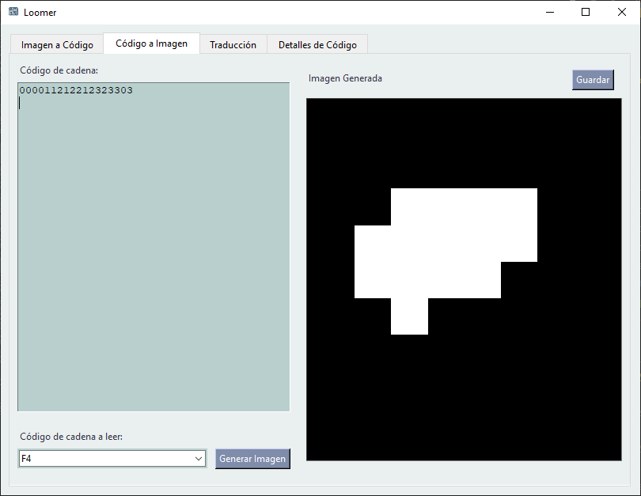
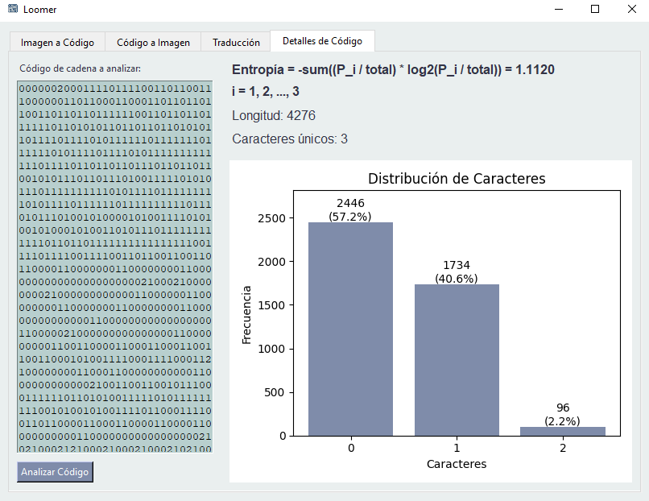

# Manual de Usuario - Loomer

  

## Índice

- [Manual de Usuario - Loomer](#manual-de-usuario---loomer)
  - [Índice](#índice)
  - [Imágenes Aceptadas](#imágenes-aceptadas)
    - [Formatos de Archivo Soportados](#formatos-de-archivo-soportados)
    - [Características Ideales de las Imágenes](#características-ideales-de-las-imágenes)
    - [Ejemplos de Imágenes Ideales](#ejemplos-de-imágenes-ideales)
    - [Imágenes a Evitar](#imágenes-a-evitar)
  - [Funcionalidades](#funcionalidades)
    - [Imagen a Código](#imagen-a-código)
      - [Pasos para Convertir una Imagen a Código:](#pasos-para-convertir-una-imagen-a-código)
      - [Consejos para Obtener Mejores Resultados:](#consejos-para-obtener-mejores-resultados)
    - [Código a Imagen](#código-a-imagen)
      - [Pasos para Convertir un Código a Imagen:](#pasos-para-convertir-un-código-a-imagen)
      - [Consejos para la Entrada de Códigos:](#consejos-para-la-entrada-de-códigos)
    - [Traducción de Códigos](#traducción-de-códigos)
      - [Pasos para Traducir Códigos:](#pasos-para-traducir-códigos)
    - [Detalles de Código](#detalles-de-código)
      - [Pasos para Analizar un Código:](#pasos-para-analizar-un-código)
      - [Información Proporcionada en el Análisis:](#información-proporcionada-en-el-análisis)
  - [Formatos de Códigos Soportados](#formatos-de-códigos-soportados)
    - [F4 (Freeman 4-direccional)](#f4-freeman-4-direccional)
    - [F8 (Freeman 8-direccional)](#f8-freeman-8-direccional)
    - [AF8 (Absoluto Freeman 8-direccional)](#af8-absoluto-freeman-8-direccional)
    - [3OT (Three Orthogonal Ternary)](#3ot-three-orthogonal-ternary)
    - [VCC (Vertex Chain Code)](#vcc-vertex-chain-code)
  - [Solución de Problemas](#solución-de-problemas)
    - [Error al cargar una imagen](#error-al-cargar-una-imagen)
    - [Error al generar código desde una imagen](#error-al-generar-código-desde-una-imagen)
    - [Error al traducir códigos](#error-al-traducir-códigos)
    - [La imagen generada no coincide con lo esperado](#la-imagen-generada-no-coincide-con-lo-esperado)

## Imágenes Aceptadas

Para obtener resultados óptimos con Loomer al convertir imágenes a códigos de cadena, es importante utilizar el tipo adecuado de imágenes. A continuación, se detallan las características recomendadas:

### Formatos de Archivo Soportados
- **PNG**: Formato recomendado por su soporte de transparencia y compresión sin pérdida.
- **JPG/JPEG**: Compatible, pero puede introducir artefactos de compresión que afecten la detección de contornos.

### Características Ideales de las Imágenes
- **Fondo blanco y objeto negro**: La aplicación está optimizada para procesar imágenes donde el objeto de interés es negro sobre un fondo blanco.
- **Alto contraste**: Las imágenes con clara diferencia entre el objeto y el fondo producen mejores resultados.
- **Contornos definidos**: Bordes nítidos y bien definidos facilitan la extracción precisa del código de cadena.
- **Formas simples**: Los objetos con contornos continuos y sin huecos internos son procesados con mayor precisión.

### Ejemplos de Imágenes Ideales
- Siluetas
- Dibujos lineales
- Iconos simples
- Formas geométricas

### Imágenes a Evitar
- Fotografías complejas con muchos detalles
- Imágenes con múltiples objetos superpuestos
- Imágenes con texturas complejas o patrones
- Imágenes con contornos difusos o borrosos
- Imágenes a color sin suficiente contraste

    
    

Siguiendo estas recomendaciones, aumentará significativamente la calidad de los códigos de cadena generados por Loomer.

## Funcionalidades

### Imagen a Código

Esta funcionalidad permite cargar una imagen y convertirla en un código de cadena en diferentes formatos (F4, F8, AF8, 3OT, VCC).

#### Pasos para Convertir una Imagen a Código:

1. Haga clic en la pestaña "Imagen a Código".
2. Presione el botón "Cargar" en el panel izquierdo para seleccionar una imagen desde su ordenador.
   - Formatos compatibles: PNG, JPG, JPEG
   - Se recomienda usar imágenes con contornos claros y definidos para mejores resultados.
3. Seleccione el formato de código deseado en el menú desplegable (F4, F8, AF8, 3OT, VCC).
4. Haga clic en el botón "Procesar" para generar el código de cadena.
5. El resultado se mostrará en el panel derecho.
6. Puede copiar el código generado seleccionándolo y usando Ctrl+C.

#### Consejos para Obtener Mejores Resultados:
- Utilice imágenes con contornos bien definidos y de alto contraste.
- Las imágenes en blanco y negro suelen producir mejores resultados que las imágenes a color.
- Para formas complejas, considere simplificar la imagen antes de procesarla.

### Código a Imagen

Esta funcionalidad permite convertir un código de cadena en una representación visual del contorno.

#### Pasos para Convertir un Código a Imagen:

1. Haga clic en la pestaña "Código a Imagen".
2. Ingrese el código de cadena en el área de texto del panel izquierdo.
   - Asegúrese de ingresar solo números, sin espacios ni caracteres especiales.
3. Seleccione el formato del código ingresado en el menú desplegable.
4. Haga clic en el botón "Generar Imagen" para crear la representación visual.
5. La imagen generada se mostrará en el panel derecho.
6. Si desea guardar la imagen, haga clic en el botón "Guardar" debajo de la imagen generada.

#### Consejos para la Entrada de Códigos:
- Verifique que el código ingresado corresponda al formato seleccionado.
- **Selección correcta del formato:** La aplicación no valida automáticamente si el código ingresado corresponde al formato seleccionado. Es crucial seleccionar el formato adecuado para obtener resultados correctos.
- Códigos más largos generarán contornos más complejos.
- Si la imagen no se genera correctamente, verifique si hay errores en el código ingresado o si ha seleccionado el formato incorrecto.

### Traducción de Códigos

Esta funcionalidad permite convertir códigos de cadena entre diferentes formatos de representación.

#### Pasos para Traducir Códigos:

1. Haga clic en la pestaña "Traducción".
2. Ingrese el código de cadena a traducir en el panel izquierdo.
3. Seleccione el formato de origen del código en el menú desplegable superior.
   - **Atención:** Es esencial seleccionar el formato correcto que corresponde al código ingresado. La aplicación no verifica automáticamente la correspondencia entre el código y el formato seleccionado.
4. Seleccione el formato de destino en el menú desplegable central.
5. Haga clic en el botón "Traducir" para convertir el código.
6. El resultado de la traducción se mostrará en el panel derecho.

### Detalles de Código

Esta funcionalidad analiza las propiedades y características de un código de cadena ingresado.

#### Pasos para Analizar un Código:

1. Haga clic en la pestaña "Detalles de Código".
2. Ingrese el código de cadena en el área de texto.
3. Seleccione el formato del código en el menú desplegable.
4. Haga clic en el botón "Analizar" para procesar el código.
5. En el panel derecho, se mostrará información detallada sobre el código, incluyendo:
   - Longitud del código
   - Distribución de direcciones
   - Entropia del código
   - Probabilidades de direcciones

#### Información Proporcionada en el Análisis:
- **Longitud Total**: Número total de elementos en el código.
- **Distribución Direccional**: Frecuencia de cada dirección en el código.
- **Entropía**: Medida de la complejidad del código.
- **Probabilidades**: Probabilidad de aparición de cada dirección en el código.

## Formatos de Códigos Soportados

Loomer soporta varios formatos de códigos de cadena, cada uno con características específicas:

### F4 (Freeman 4-direccional)
- Utiliza 4 direcciones para representar los movimientos en un contorno:
  - **0**: Movimiento hacia el Este (→)
  - **1**: Movimiento hacia el Norte (↓)
  - **2**: Movimiento hacia el Oeste (←)
  - **3**: Movimiento hacia el Sur (↑)
- Es el formato más simple pero efectivo para representar contornos básicos.

### F8 (Freeman 8-direccional)
- Utiliza 8 direcciones para representar movimientos incluyendo diagonales:
  - **0**: Este (→)
  - **1**: Noreste (↘)
  - **2**: Norte (↓)
  - **3**: Noroeste (↙)
  - **4**: Oeste (←)
  - **5**: Suroeste (↖)
  - **6**: Sur (↑)
  - **7**: Sureste (↗)

### AF8 (Absoluto Freeman 8-direccional)
- Define 8 direcciones absolutas en el espacio:
  - **0**: Este (→→)
  - **1**: Noreste (→↘)
  - **2**: Este y luego Sur (→↓)
  - **3**: Noreste (→↙)
  - **4**: Oeste (→←)
  - **5**: Oeste y luego Sur (→↖)
  - **6**: Sur y luego Este (→↑)
  - **7**: Sureste (→↗)

### 3OT (Three Orthogonal Ternary)
- Utiliza un sistema ternario con 3 valores posibles:
  - **0**: Giro a la derecha seguido de un movimiento recto (→→)
  - **1**: Giro de 90° hacia arriba seguido de un movimiento recto (→↑→)
  - **2**: Giro de 90° hacia arriba y luego a la izquierda (→↑←)

### VCC (Vertex Chain Code)
- Basado en la conectividad de vértices en una cuadrícula:
  - **0**: Movimiento horizontal hacia la derecha (→→)
  - **1**: Movimiento vertical hacia arriba (↑→)
  - **2**: Movimiento diagonal superior derecha (→↑)

## Solución de Problemas

### Error al cargar una imagen
- Asegúrese de que la imagen está en un formato compatible (PNG, JPG, JPEG).
- Verifique que la imagen no esté corrupta.
- Intente con una imagen más pequeña o de menor resolución.

### Error al generar código desde una imagen
- Utilice imágenes con contornos claros y bien definidos.
- Intente con imágenes en blanco y negro para mejorar los resultados.
- Las imagenes tienen que tener el objeto en color negro y el fondo en blanco.
- Evite imágenes con muchos detalles o ruido.

### Error al traducir códigos
- Verifique que el código de origen corresponda al formato seleccionado.
- Asegúrese de ingresar solo números, sin espacios ni caracteres especiales.
- **Importante:** La aplicación no verifica automáticamente que el código de cadena ingresado corresponda al formato seleccionado. Es responsabilidad del usuario asegurarse de seleccionar el formato correcto.
- Algunos formatos tienen restricciones específicas en los valores válidos.

### La imagen generada no coincide con lo esperado
- Verifique que el formato del código ingresado sea correcto.
- **Verifique el selector de formato:** Asegúrese de haber seleccionado el formato correcto que corresponde al tipo de código que ha ingresado.
- Algunos códigos muy largos o complejos pueden no visualizarse correctamente.
- Intente simplificar el código o utilizar un formato diferente.

  <a href="#top">Volver al inicio ↑</a>

