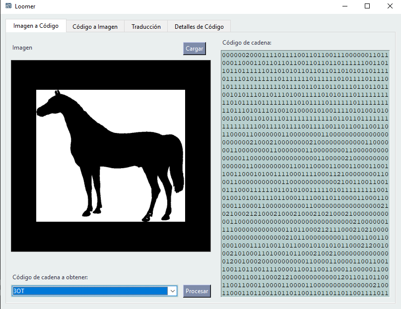
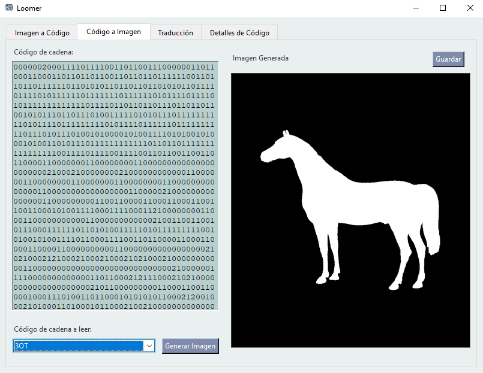
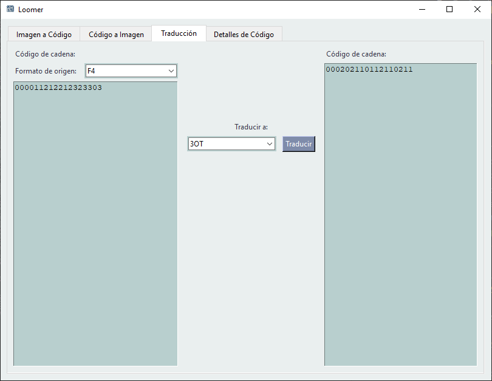
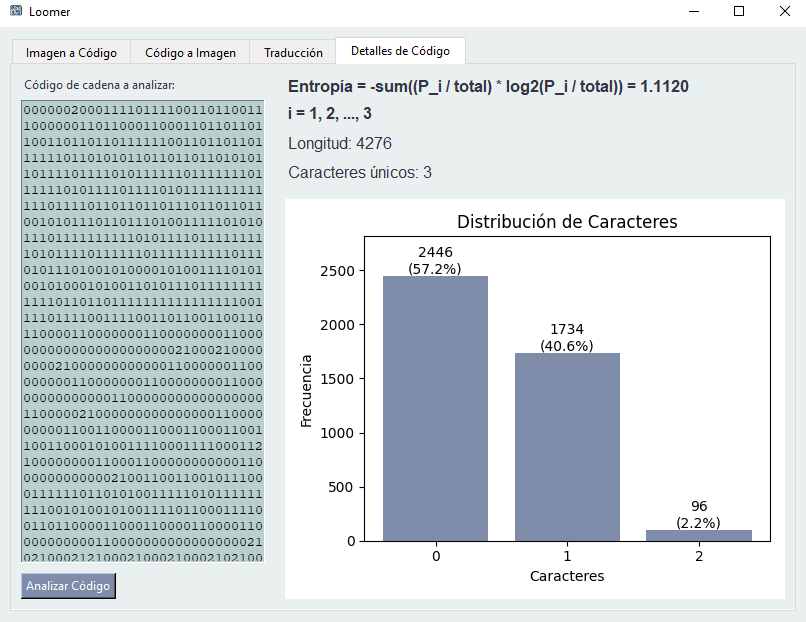

# Loomer

<p align="center">
  
</p>

Loomer es una aplicación para procesar y gestionar códigos de cadena con interfaz gráfica. Permite convertir entre imágenes y representaciones numéricas de contornos (códigos de cadena) a través de una interfaz intuitiva y funcional.

## Tabla de Contenidos

- [Loomer](#loomer)
  - [Tabla de Contenidos](#tabla-de-contenidos)
  - [Instalación](#instalación)
  - [Ejecución](#ejecución)
  - [Descargas](#descargas)
  - [Funcionalidades](#funcionalidades)
    - [Imagen a Código](#imagen-a-código)
    - [Código a Imagen](#código-a-imagen)
    - [Traductor de Códigos](#traductor-de-códigos)
    - [Analizador de Códigos](#analizador-de-códigos)
  - [Formatos de Códigos Soportados](#formatos-de-códigos-soportados)

## Instalación

Para instalar Loomer desde el código fuente, asegúrese de tener Python 3.7 o superior instalado y siga estos pasos:

1. Clone el repositorio o descargue el código fuente
2. Navegue al directorio del proyecto
3. Instale las dependencias usando `uv`:

```powershell
# Instalar uv si no lo tiene
pip install uv

# Descarga las dependencias en un entorno virtual
uv sync
```

## Ejecución

Para ejecutar Loomer desde el código fuente:

```powershell
# Activar el entorno virtual (si es necesario)
# Con uv no es necesario activar explícitamente

# Ejecutar el programa principal
uv run new_main.py
```

## Descargas

La versión más reciente de Loomer está disponible en la sección de [Releases](https://github.com/IkarosKurtz/Loomer/releases). Descargue el archivo ejecutable para **Windows** e inicie la aplicación sin necesidad de instalar Python.

## Funcionalidades

### Imagen a Código

Permite cargar una imagen y convertirla en un código de cadena en diferentes formatos (F4, F8, AF8, 3OT, VCC).

<p align="center">
  
</p>

**Uso:**
1. Haga clic en "Cargar" para seleccionar una imagen
2. Seleccione el formato de código deseado en el menú desplegable
3. Presione "Procesar" para generar el código de cadena
4. El resultado se mostrará en el panel derecho

### Código a Imagen

Convierte un código de cadena ingresado en una imagen visual del contorno representado.

<p align="center">
  
</p>

**Uso:**
1. Ingrese el código de cadena en el área de texto
2. Seleccione el formato del código ingresado
3. Haga clic en "Generar Imagen" para crear la representación visual
4. Utilice "Guardar" para conservar la imagen generada

### Traductor de Códigos

Permite convertir códigos de cadena entre diferentes formatos de representación.

<p align="center">
  
</p>

**Uso:**
1. Ingrese el código de cadena en el panel izquierdo
2. Seleccione el formato de origen
3. Elija el formato de destino en el panel central
4. Haga clic en "Traducir" para convertir el código
5. El resultado se mostrará en el panel derecho

### Analizador de Códigos

Analiza las propiedades y características de un código de cadena ingresado.

<p align="center">
  
</p>

**Uso:**
1. Ingrese el código de cadena en el área de texto
2. Seleccione el formato del código
3. Presione "Analizar" para procesar el código
4. Visualice la información detallada del código en el panel derecho

## Formatos de Códigos Soportados

Loomer soporta los siguientes formatos de códigos de cadena:

- **F4**: Código de cadena Freeman de 4 direcciones (Este, Norte, Oeste, Sur)
- **F8**: Código de cadena Freeman de 8 direcciones (incluye diagonales)
- **AF8**: Código de cadena Freeman de 8 direcciones absoluto
- **3OT**: Código de cadena Three Orthogonal Ternary
- **VCC**: Código de cadena de conectividad de vértices
